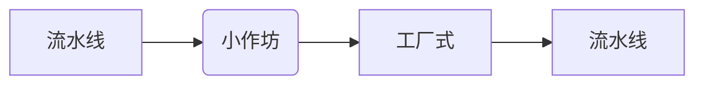
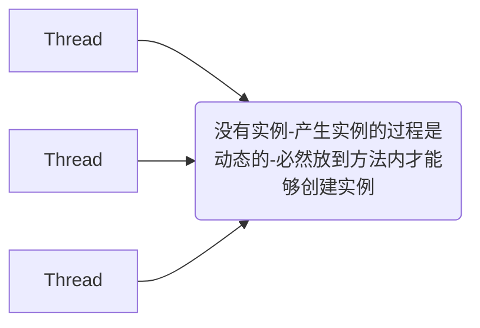
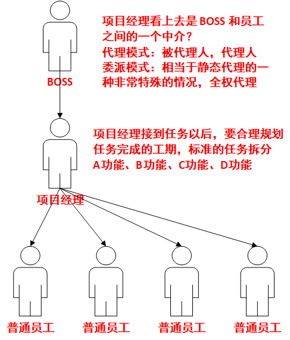
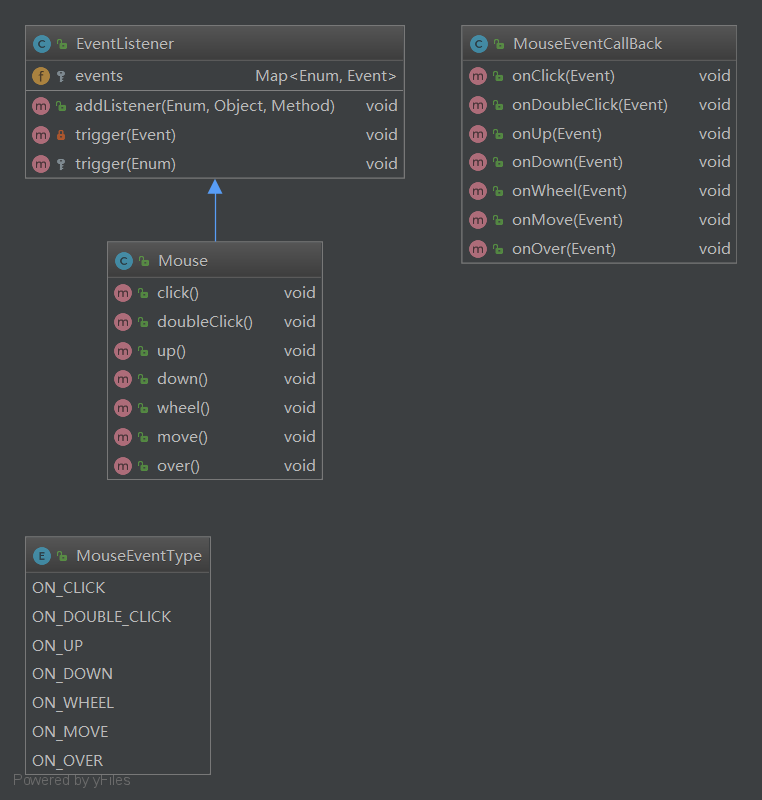
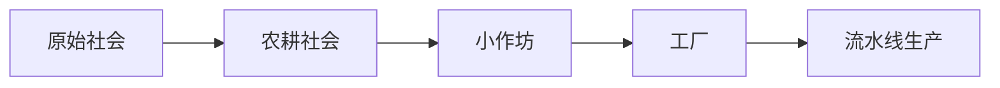

[TOC]


# 项目说明：

- **`pattern-factory`**： **工厂模式**
- **`pattern-singleton` ：单例模式**
- **`pattern-prototype` ： 原型模式**
- **`pattern-proxy` ： 代理模式**
- **`pattern-strategy` ：策略模式**
- **`pattern-template` ： 模板模式**
- **`pattern-delegate` ：委派模式**
- **`pattern-adapter` ： 适配器模式**
- **`pattern-decorator` ：装饰器模式**
- **`pattern-observer`： 观察者模式**
- **`photo`： 相关的图片**


# 设计模式：

> 怎么做人？
>
> 中国来说：
>
> - 出生 、二十加冕、三十而立、四十不惑、五十知天命、六十花甲...

## 经验之谈：

> 总结前人的经验，提供给后人去借鉴使用

​	 **前人栽树，后人乘凉**

## 用途

> 解决一些具有代表性的一些问题。
>
> ​	设计模式，通常来源于生活，反过来帮助我们更好的生活

设计模式

​	 **提升代码的可读性、可扩展性、维护成本、复杂的业务问题**

## 忠告

> 千万不要**死记硬背**

每个**设计模式**都会结合一个生活案例去讲解， **穷举法**。

# 历史

- **集体生活**
- **小作坊** `提升产品的质量，提高生产的效率`
- **工厂式** `大规模的标准化的批量生产`
- **流水线** `一条流水线值生产一个产品。A-某个零件；B-某个零件`

> **解决了用户与产品之间的问题**


### 工厂模式发展史图片：



### 简单工厂模式：

- **BeanFacotry** (BeanDefinetion)
  - 生产 **Bean**
    - `< Bean Scope = "single" >`
    - `< Bean Scope = "prototype" >`

#### 实现了：

> ISO标准，GB标准


> 工厂的分工越来越细


## 抽象工厂模式：

抽象类定义抽象方法，

实现类去实现。


# 代码


### 基础代码：

##### `Milk`.class

```java
public interface Milk {

    /**
     * 获取一个标准产品
     * <br>Darian
     **/
    public String getName();
}
```

##### `MengNiu`.class

```java
@Data
public class MengNiu implements Milk {

    private String name = "MengNiu";

    @Override
    public String getName() {
        return name;
    }
}
```

##### `SanLu`.class

```java
@Data
public class SanLu implements Milk {

    private String name = "SanLu";
    
    @Override
    public String getName() {
        return name;
    }
}
```

##### `TeLunSu`.class

```java
@Data
public class TeLunSu implements Milk {

    private String name = "TeLunSu";

    @Override
    public String getName() {
        return name;
    }
}
```

##### `YiLi`.class

```java
@Data
public class YiLi implements Milk {

    private String name = "YiLi";
    
    @Override
    public String getName() {
        return name;
    }
}
```

### 小作坊式工厂模式：

##### `SimpleFactory` .class

```java
public class SimpleFactory {
    public Milk getMilk(String name) {
        if ("TeLunSu".equals(name)) {
            return new TeLunSu();
        } else if ("YiLi".equals(name)) {
            return new YiLi();
        } else if ("MengNiu".equals(name)) {
            return new MengNiu();
        }
        System.out.println("不能生产您所需的产品");
        return null;
    }
}
```

##### `SimpleFactoryTest`.class

```java
public class SimpleFactoryTest {

    public static void main(String[] args) {

        // 这个 new 的过程实际上是一个比较复杂的过程
        // 有人民币就不需要自己 new 了
        // System.out.println(new TeLunSu().getName());

        // 小作坊式的生产模式
        // 用户不再关心生产的过程，而只需要关心这个结果

        // 假如：特仑苏、伊利、蒙牛
        // 成分配都是不一样的
        SimpleFactory simpleFactory = new SimpleFactory();
        System.out.println(simpleFactory.getMilk("TeLunSu"));
        System.out.println(simpleFactory.getMilk("YiLi"));
        System.out.println(simpleFactory.getMilk("MengNiu"));
    }
}
```

### 简单工厂模式

##### `Facotry`.class

```java
/**
 * 工厂模型
 * <br>Darian
 **/
public interface Facotry {

    /**
     * 工厂必然具有生产产品技能，统一的产品出口
     **/
    Milk getMilk();
}
```

##### `MengNiuFacotry`.class

```java
public class MengNiuFacotry implements Facotry {
    @Override
    public Milk getMilk() {
        return new MengNiu();
    }
}
```

##### `TeLunSuFacotry`.class

```java
public class TeLunSuFacotry implements Facotry {
    @Override
    public Milk getMilk() {
        return new TeLunSu();
    }
}
```

##### `YiLiFactory`.class

```java
public class YiLiFactory implements Facotry {
    @Override
    public Milk getMilk() {
        return new YiLi();
    }
}
```

##### `FactoryTest`.class

```java
public class FactoryTest {
    public static void main(String[] args) {
        // 货比三家，
        // 不知道谁好谁坏
        // 配置，可能会配置错
        MengNiuFacotry mengNiuFacotry = new MengNiuFacotry();
        System.out.println(mengNiuFacotry.getMilk());
        YiLiFactory yiLiFactory = new YiLiFactory();
        System.out.println(yiLiFactory.getMilk());
        TeLunSuFacotry teLunSuFacotry = new TeLunSuFacotry();
        System.out.println(teLunSuFacotry.getMilk());
    }
}
```

### 抽象工厂模式

##### `AbstractFactory`.class

```java
/**
 * 抽象工厂是用户的主入口
 * 在 Spring 种应用得最为广泛的一种设计模式
 * 易于拓展
 * <br>Darian
 **/
public abstract class AbstractFactory {

    // 公共的逻辑
    // 方便于统一的管理

    /**
     * 获得一个 MengNiu
     **/
    public abstract Milk getMengNiu();
    /**
     * 获得一个 YiLi
     **/
    public abstract Milk getYiLi();
    /**
     * 获得一个 TeLunSu
     **/
    public abstract Milk getTeLunSu();

    public abstract Milk getSanLu();
}
```

##### `MilkFactory`.class

```java
public class MilkFactory extends AbstractFactory {

    @Override
    public Milk getMengNiu() {
        return new MengNiuFacotry().getMilk();
    }

    @Override
    public Milk getYiLi() {
        return new YiLiFactory().getMilk();
    }

    @Override
    public Milk getTeLunSu() {
        return new TeLunSuFacotry().getMilk();
    }

    @Override
    public Milk getSanLu() {
        return new SanLu();
    }
}
```

##### `AbstractFactoryTest`.class

```java
public class AbstractFactoryTest {

    public static void main(String[] args) {
        MilkFactory milkFactory = new MilkFactory();
        /**
         * 对于用户而言，更加简单明了
         * 用户只有选择的权力了，保证了程序的健壮性
         **/
        System.out.println(milkFactory.getMengNiu());
        System.out.println(milkFactory.getYiLi());
    }
}
```


----------------------------------------------

------------------------

# 单例模式

全局只有唯一一个实例，

> ​	 **一个类模板，在整个系统运行中，只允许产生一个实例（有且只有一个实例（有且只有一个）**
>
> ​	new 
>
> ​	分布式系统中用 `分布式锁` 来保证单例模式。


## 例子：

- **工厂本身**
- **配置文件**
- **日历**

## 保证单例模式的技术方案

> ​	解决一个并发访问时的时候的线程安全问题。

- **饿汉式**
- **懒汉式**
- **注册等级式**
- **枚举式**
- **序列化于反序列化时会出现多例**

### 饿汉式：

> ​	 **在实例使用之前，不管你用不用，我都先 new 出来再说，避免了线程安全问题**

### 饿汉式：

> ​	 **默认加载的时候不是梨花，在需要用到这个实例的时候才实例化。`延时加载`**

### 注册登记式：

> ​	 **每使用一次，都往固定的容器中去注册，并且讲使用过的对象进行缓存，下次区区对象的时候，就直接从缓存中取值，以保证每次获取的都是同一个对象， `IOC` 中的单例模式，就是典型的注册登记式单例 **

### 枚举式：

> ​	 **用于一些常量值的定义里边**

### 序列化与反序列化：

> ​	 **保证单例**
>
> - **重写  `readResolve()`**


# 原型模式：

- DTO
- VO
- POJO
- Entity

> **属性基本一样**
>
> **DTO 和 VO 之间存在一些属性名称、类型都相同。**
>
> **从数据库中表查出来的对象会赋值给 DTO**
>
> **MVC 中的 Model**
>
> **把 DTO 中的值会赋值给 VO**
>
> **再把 VO 中的值传输到 View 中去**

​	 **复制，就是要把 DTO 中每一个属性的值赋值给 VO 中的每一个属性的值，属性名称相同，属性类型相同**

> ​	  **springframework 或者 apache 都是利用反射来实现的。**

##### BeanUtils.copyProperties

```java
public class TestBeanUtils {
    public static void main(String[] args) throws InvocationTargetException, IllegalAccessException {
        TestBeanUtilsObject testBeanUtilsObject1_a = new TestBeanUtilsObject();
        testBeanUtilsObject1_a.setName("aaa");
        TestBeanUtilsObject testBeanUtilsObject1_b = new TestBeanUtilsObject();
        // springframework -> copyProperties ( source -> target )
        // 源信息 -> 复制品
        org.springframework.beans.BeanUtils.copyProperties(testBeanUtilsObject1_a, testBeanUtilsObject1_b);
        System.out.println(testBeanUtilsObject1_b);

        TestBeanUtilsObject testBeanUtilsObject2_a = new TestBeanUtilsObject();
        testBeanUtilsObject2_a.setName("bbb");
        TestBeanUtilsObject testBeanUtilsObject2_b = new TestBeanUtilsObject();
        // apache -> copyProperties ( dest ->  orig)
        // 复制品 -> 源信息
        org.apache.commons.beanutils.BeanUtils.copyProperties(testBeanUtilsObject2_b,  testBeanUtilsObject2_a);
        System.out.println(testBeanUtilsObject2_b);
    }
}
```

### Clone

> ​	 **克隆羊，克隆人 DNA**
>
> **孙悟空，一个毫毛**

```xml
<-- 把对象中配置的依赖关系，在么此使用对象之前，都会创建一个新的对象，并且会将依赖关系完整的赋值给这个新创建的对象 -->
<Bean scopt = "prototype">
```

 **Spring** 默认是 **单例模式**。


## 20180308

### 上课目的：

> ​	 **为了帮助打击解决一些疑惑，同学们获得更好的体验，更加透彻的理解设计模式：单例模式和原型的应用场景**

### 学习效果：

> ​	 **抓住重点，理解单例模式和原型模式的设计思想**

## 单例模式：

​	 **初衷就是为了是资源能够共享，只需要赋值或者初始化一次，大家都能够重复利用**

### 应用场景

- **Listener 本身**
- **日历 Calender**
- **IOC 容器**
- **配置信息 Config**

### 技术方案

> **保证整个运行过程只有一份**

- **饿汉式**
- **懒汉式**
- **注册登记式（枚举）**
- **反序列化如何保证单例**

### 解决问题

**恶劣环境（程序的健全性）**

> 实例已经存在了



一声令下：

所有的线程开始奔跑，等待所有的运动员叨叨重点，才能开始进行排名，等待 就是 awit ，


## 单例模式代码：

### 饿汉式：

##### `Hungry`.class

```java
/**
 * 饿汉式单例
 * 它实在类加载的时候就立即初始化，并且创建单例对象
 *
 * 优点： 没有加任何的锁、执行效率比较高
 * 在用户体验上来说，比懒汉式更好
 *
 * 缺点：类加载的时候就初始化，不管你用还是不用，我都站着空间
 * 浪费了内存，有可能站着茅坑不拉屎
 *
 * 绝对线程安全，在线程还没出现以前就实例化了，就不能有线程安全问题
 **/
public class Hungry {
    private Hungry() {
    }

    // 先静态、后动态
    // 先属性、后方法
    // 先上、后下
    private static final Hungry HUNGRY = new Hungry();

    public static Hungry getInstence() {
        return HUNGRY;
    }
}

```

### 懒汉式：

##### `LazyOne`.class

```java
/**
 * 懒汉式单例
 * 在外部需要使用的时候才能够进行实例化
 **/
public class LazyOne {
    private LazyOne() {
    }
    // 静态快，公共内存区域
    private static LazyOne lazy = null;

    public static LazyOne getInstence(){
        // 调用方法之前，先判断
        // 如果没有初始化，将其进行初始化，并且赋值
        // 将该实例缓存好
        if(lazy == null){
            // 两个线程都会进入这个 if 方法
            lazy = new LazyOne();
        }
        // 如果已经初始化，直接返回之前已经保存好的结果
        return lazy;
    }
}
```

##### `LazyTwo`.class

```java
public class LazyTwo {
    private LazyTwo() {
    }
    private static LazyTwo lazy = null;

    public static synchronized LazyTwo getInstence(){
        if(lazy == null){
            lazy = new LazyTwo();
        }
        return lazy;
    }
}
```

##### `LazyThreeStatic`.class

```java
public class LazyThreeStatic {

    public static final LazyThreeStatic getInstence() {
        return LazyHolder.LAZY_THRER_STATIC;
    }

    private static class LazyHolder {
        private static final LazyThreeStatic LAZY_THRER_STATIC = new LazyThreeStatic();
    }
}
```

##### `LazyThreeBoolean`.class

```java
/**
 * 懒汉式单例，
 * 特点：在外部类被调用的时候，内部类才会被加载
 * 内部类一定是要在方法调用之前初始化
 * 巧妙的避免了线程安全问题
 *
 * 这种形式兼顾了懒汉式的内存浪费，也兼顾 synchronized 性能问题
 * 完美的屏蔽了这两个缺点
 * 史上最牛逼的单例的模式的实现方式
 **/
public class LazyThreeBoolean {
    private static boolean initialized = false;

    // 默认使用 LazyThreeStatic 的时候，会先初始化内部类，
    // 如果没使用的话，内部类是不加载的。

    private LazyThreeBoolean() {
        synchronized (LazyThreeBoolean.class) {
            if (initialized == false) {
                initialized = !initialized;
            }else {
                throw new RuntimeException("单例已经被侵犯！！！");
            }
        }
    }

    // 每一个关键字都不是多余的
    // static 是为了单例的空间能够共享
    // final 保证这个放啊发不会被重写，重载
    public static final LazyThreeBoolean getInstence() {
        // 在返回结果以前，一定会加载内部类
        return LazyThreeBoolean.LazyHolder.LAZY_THREE_BOOLEAN;
    }

    // 默认不加载
    private static class LazyHolder {
        private static final LazyThreeBoolean LAZY_THREE_BOOLEAN = new LazyThreeBoolean();
    }
}
```

### 注册式单例：

##### `BeanFactory`.class

```java
/**
 * Spring 中常用的就是注册式单例
 **/
public class BeanFactory {

    private BeanFactory() {
    }

    // 线程安全
    private static Map<String, Object> ioc = new ConcurrentHashMap<String, Object>();

    public static synchronized Object getBean(String className) {
        if (!ioc.containsKey(className)) {
            Object obj = null;
            try {
                obj = Class.forName(className).newInstance();
                 ioc.put(className, obj);
            } catch (Exception e) {
                e.printStackTrace();
            }
            return obj;
        } else {
            return ioc.get(className);
        }
    }
}
```

##### `Color`.class

```java

```


### 序列化：

##### `Seriable`.class

```java
/**
 * 反序列化导致单例破坏
 **/
public class Seriable implements Serializable {

    // 序列化就是把内存中的状态通过转换成字节码的形式
    // 从而转化成一个 I/O 流，写入到其他地方（可以是磁盘，网络 I/O）
    // 内存中状态给永久保存下来了

    // 反序列化
    // 将已经持久化的字节码内容，转化为 I/O 流
    // 通过 I/O 流的读取，进而将读取的内容转换为 JAVA 对象
    // 在转化过程中会重新创建对象 new 

    public final static  Seriable INSTANCE = new Seriable();

    private Seriable(){}
    public static Seriable getInstance(){
        return INSTANCE;
    }

    private Object readResolve(){
        return INSTANCE;
    }

}
```


##### `ThreadSafeTest`.class 测试性能安全问题

```java
public class ThreadSafeTest {

    public static void main(String[] args) {
        int count = 100;
        // 发令枪,
        final CountDownLatch countDownLatch = new CountDownLatch(count);
        for (int i = 0; i < count; i++) {
            new Thread() {
                @Override
                public void run() {
                    // 如果相同时间点，打出来的实例是一样的，表示线程安全
                    try {
                        // 阻塞
                        // count = 0 ,就会释放所有的共享锁
                        // 万箭齐发
                        countDownLatch.await();
                        Object obj = LazyOne.getInstence();
//                        Object obj = LazyTwo.getInstence();
                        // 必然会调用，可能忽悠很多线程去同时覅访问 getInstance()
//                        Object obj = LazyThreeStatic.getInstence();
//                        Object obj = BeanFactory.getBean("com.darian.pattern.singleton.test.Pojo");
                        System.out.println(System.currentTimeMillis() + ":" + obj);
                    } catch (Exception e) {
                        e.printStackTrace();
                    }
                }
            }.start();// 每循环一次，就启动一个线程
            // 每次启动一个线程，count--
            countDownLatch.countDown();
        }
    }
}
```


##### `TimeTest`.class-测试性能问题

```java
public class TimeTest {
    public static void main(String[] args)   {
        long start = System.currentTimeMillis();
        int count = 20000000;
        for (int i = 0; i < count; i++) {
//            LazyTwo.getInstence();
//            LazyOne.getInstence();
            LazyThreeStatic.getInstence();
        }
        long end = System.currentTimeMillis();
        System.out.println("总耗时：" + (end - start));
    }
}
```


##### `TestSeriable`.class 测试序列化与反序列化

```java
public class TestSeriable {
    public static void main(String[] args) {
        Seriable s1 = null;
        Seriable s2 = Seriable.getInstance();

        try {
            FileOutputStream fileOutputStream = new FileOutputStream("Seriable.obj");
            ObjectOutputStream objectOutputStream = new ObjectOutputStream(fileOutputStream);
            objectOutputStream.writeObject(s2);
            objectOutputStream.flush();
            objectOutputStream.close();

            FileInputStream fileInputStream = new FileInputStream("Seriable.obj");
            ObjectInputStream objectInputStream = new ObjectInputStream(fileInputStream);
            s1 = (Seriable) objectInputStream.readObject();
            objectInputStream.close();

            System.out.println(s1);
            System.out.println(s2);
            System.out.println(s1 == s2);

        } catch (Exception e) {
            e.printStackTrace();
        }
    }
}

```


##### `TestProxy`.class 测试单例被破坏

```java
public class TestProxy {
    public static void main(String[] args) {
        try {
            Class<?> clazz = LazyThreeBoolean.class;
            // 通过反射拿到私有的构造方法。
            Constructor<?> constructor = clazz.getDeclaredConstructor();
            // 强制访问，强吻，不愿意也要问
            constructor.setAccessible(true);
            // 暴力初始化
            Object o1 = constructor.newInstance();
            // 调用了两次构造方法，相当于 new 了两次
            // 犯了原则性问题，
            Object o2 = constructor.newInstance();
            System.out.println(o1 == o2);
        } catch (Exception e) {
            e.printStackTrace();
        }
    }
}
```


##### `ColorTest`.class 测试枚举式单例

```java
public class ColorTest {
    public static void main(String[] args) {
        System.out.println(Color.RED);
    }
}
```

## 原型模式代码：

##### `QiTianDaSheng`.class-用序列化实现深度克隆

```java
@Data
public class QiTianDaSheng extends Monkey implements Cloneable, Serializable {
    private JinGuBang jinGuBang;

    public QiTianDaSheng() {
        // 只是初始化
        super.setBrithday(new Date());
        this.jinGuBang = new JinGuBang();
    }

    @Override
    public Object clone() throws CloneNotSupportedException {
//        return super.clone();
        return this.deepClone();
    }

    public Object deepClone() {
        try {
            ByteArrayOutputStream byteArrayOutputStream = new ByteArrayOutputStream();
            ObjectOutputStream objectOutputStream = new ObjectOutputStream(byteArrayOutputStream);
            objectOutputStream.writeObject(this);

            ByteArrayInputStream byteArrayInputStream = new ByteArrayInputStream(byteArrayOutputStream.toByteArray());
            ObjectInputStream objectInputStream = new ObjectInputStream(byteArrayInputStream);
            QiTianDaSheng copy = (QiTianDaSheng) objectInputStream.readObject();
            copy.setBrithday(new Date());
            return copy;
        } catch (Exception e) {
            e.printStackTrace();
        }
        return null;
    }

    public QiTianDaSheng copy(QiTianDaSheng target) {
        QiTianDaSheng qiTianDaSheng = new QiTianDaSheng();
        qiTianDaSheng.setHeight(target.getHeight());
        qiTianDaSheng.setWeight(target.getWeight());
        JinGuBang jinGuBang = new JinGuBang();
        jinGuBang.setD(target.getJinGuBang().getD());
        jinGuBang.setH(target.getJinGuBang().getH());
        qiTianDaSheng.setJinGuBang(jinGuBang);
        qiTianDaSheng.setBrithday(new Date());
        return qiTianDaSheng;
    }
}
```

##### `TestPrototype`.class 测试原型模式，

```java
public class TestPrototype {
    public static void main(String[] args) {
        QiTianDaSheng qiTianDaSheng = new QiTianDaSheng();

        try {
            QiTianDaSheng clone =(QiTianDaSheng) qiTianDaSheng.clone();
            System.out.println(qiTianDaSheng.getJinGuBang() == clone.getJinGuBang());
        } catch (Exception e) {
            e.printStackTrace();
        }

        QiTianDaSheng copy = qiTianDaSheng.copy(qiTianDaSheng);
        System.out.println(copy == qiTianDaSheng);
    }
}
```

##### `Monkey`.class

```java
@Data
public class Monkey {
    private int height;
    private int weight;
    private Date brithday;
}
```

##### `JinGuBang`.class

```java
@Data
public class JinGuBang implements Serializable {
    private float h = 100;
    private float d = 1;

    public void big() {
        this.h *= 2;
        this.d *= 2;
    }

    public void small() {
        this.d /= 2;
        this.h /= 2;
    }
}
```


---------

----------------

# 代理模式

## 作用：

- AOP 实现
- 拦截器
- 中介
- 黄牛
- 媒婆
- 解耦
- 专人做专事
- 自己不想做，有不得不做的事
- 增强

## 代理：

- #### **静态代理**

- #### **动态代理**

### 角色

- 代理角色

- 被代理的角色（目标对象）

    	 **由被代理的角色来做最终的决定** 

	  ​	 **代理角色通常来说会持有被代理角色对象引用（以便于代理角色完成工作之前或者之后能够找到被带离的对象，能够通知被代理对象）**

### 静态代理动态代理的区别：

#### 静态代理：

​		 **在代理之前所有的东西都是已知的（人工）**

#### 动态代理：

​		 **在代理之前，所有的东西都是未知的（自动化，智能化）**

## 总结：

### 静态代理：

 ==没办法拓展==

### JKD动态代理的原理

> 1. **拿到被代理的对象的引用，并且获取到它的所有接口，反射获取**
> 2. **JDK Proxy 类重新生成一个新的类，同时新的类要实现被代理类的所有实现**
> 3. **动态的生成 Java 代码,把新加的业务逻辑方法由一定的逻辑代码去调用（在代码中体现）**
> 4. **编译新生成的 Java 代码， .class**
> 5. **再重新加载到 JVM 中运行**

​		以上这个过程就叫字节码重组

​		 JDK 中有个规范，只要是 $ 开头的一般都是自动生成的。

​		 通过反编译工具可以查看源代码。

### 手写动态代理的原理

1. **动态生成源代码 .java 文件**
2. **JAVA 文件输出到磁盘**
3. **把 .java 文件编译成 .class 文件**
4. **编译生成的 .class 文件加载到 JVM 中，**
5. **返回字节码重组以后的新的代理对象**


##### ==photo/代理的形象.jpg==


##### ==photo/代理的类图.jpg==


# 代码：

## 静态代理：

##### `Person`.class

```java
public interface Person {
    void findLove();

    void zuFangZi();

    void buy();

    void findJob();
}
```

##### `Son`.class

```java
public class Son implements Person {
    public void findLove() {
        // 我没有时间
        // 工作忙
        System.out.println(">>>>>找对象：肤白，貌美，大长腿");
    }

    public void zuFangZi() {

    }

    public void buy() {

    }

    public void findJob() {

    }
}
```

##### `Father`.class

```java
public class Father {
    private Person person;

    // 没办法拓展
    public Father(Person person) {
        this.person = person;
    }

    // 目标对象的引用给拿到
    public void findLove(){
        System.out.println("根据你的要求物色");
        this.person.findLove();
        System.out.println("双方父母是不是同意");
    }
}
```

##### `StaticProxyTest`.class

```java
public class StaticProxyTest {
    public static void main(String[] args) {
        // 只能帮儿子找对象
        // 不能帮表妹、陌生人
        Father father = new Father(new Son());
        father.findLove();
    }
}
```

## JDK:

##### `XieMu`.class

```java
public class XieMu implements Person {
    public void findLove(){
        System.out.println(">>>>>高富帅");
        System.out.println(">>>>>身高180");
        System.out.println(">>>>>胸大，6块腹肌");
    }

    public void zuFangZi() {
        System.out.println(">>>>>租房子");
    }

    public void buy() {
        System.out.println(">>>>>买东西");
    }
    public void findJob() {
        System.out.println(">>>>>月薪20K");
        System.out.println(">>>>>找工作");
    }
}
```

##### `JDK58`.class

```java
public class JDK58 implements InvocationHandler {
    // 被代理的对象，把引用给保存下来
    public Person target;

    public Object getInstence(Person target) throws Exception {
        this.target = target;
        Class<? extends Person> clazz = target.getClass();

        // 下半节，深入底层将界字节码是如何重组的。
        // 用来生成一个新的对象（字节码重组来实现）
        //  public static Object newProxyInstance(ClassLoader loader, Class<?>[] interfaces, InvocationHandler h)
       return  Proxy.newProxyInstance(clazz.getClassLoader(), clazz.getInterfaces(), this);
    }

    public Object invoke(Object proxy, Method method, Object[] args) throws Throwable {
        System.out.println("我是58，我要给你找工作，现在已经拿到你的简历");
        System.out.println("开始投递");
        method.invoke(this.target,args);
        System.out.println("安排面试");
        return null;
    }
}
```

##### `JDKMeiPo`.class

```java
public class JDKMeiPo implements InvocationHandler {
    // 被代理的对象，把引用给保存下来
    public Person target;

    public Object getInstence(Person target) throws Exception {
        this.target = target;
        Class<? extends Person> clazz = target.getClass();

        // 下半节，深入底层将界字节码是如何重组的。
        // 用来生成一个新的对象（字节码重组来实现）
        //  public static Object newProxyInstance(ClassLoader loader, Class<?>[] interfaces,InvocationHandler h)
       return  Proxy.newProxyInstance(clazz.getClassLoader(), clazz.getInterfaces(), this);
    }

    public Object invoke(Object proxy, Method method, Object[] args) throws Throwable {
        System.out.println("我是媒婆，我要给你找对象，现在已经拿到你的需求");
        System.out.println("开始物色");
        method.invoke(this.target,args);
        System.out.println("如果合适的话，就准备办事！");
        return null;
    }
}
```

##### `JDKProxyTest`.class

```java
public class JDKProxyTest {
    public static void main(String[] args) throws Exception {
//        Person person = (Person)new JDKMeiPo().getInstence(new XieMu());
//        person.findLove();
        Person person = (Person)new JDK58().getInstence(new XieMu());
        System.out.println(person.getClass());
        person.findJob();

        // 原理：
//        1. 拿到被代理的对象的引用，并且获取到它的所有接口，反射获取
//        2. JDK Proxy 类重新生成一个新的类，同时新的类要实现被代理类的所有实现
//        3. 动态的生成 Java 代码,把新加的业务逻辑方法由一定的逻辑代码去调用（在代码中体现）
//        4. 编译新生成的 Java 代码， .class
//        5. 再重新加载到 JVM 中运行
//        以上这个过程就叫字节码重组


//        JDK 中有个规范，只要是 $ 开头的一般都是自动生成的。
//        通过反编译工具可以查看源代码。
        byte[] bytes = ProxyGenerator.generateProxyClass("$Proxy0", new Class[]{Person.class});
        FileOutputStream fileOutputStream = new FileOutputStream("$Proxy0.class");
        fileOutputStream.write(bytes);
        fileOutputStream.close();
    }
}
```

##### `$Proxy0`.class ---JKD反射生成的源码

```java
//
// Source code recreated from a .class file by IntelliJ IDEA
// (powered by Fernflower decompiler)
//

import com.darian.pattern.staticed.Person;
import java.lang.reflect.InvocationHandler;
import java.lang.reflect.Method;
import java.lang.reflect.Proxy;
import java.lang.reflect.UndeclaredThrowableException;

public final class $Proxy0 extends Proxy implements Person {
    private static Method m1;
    private static Method m4;
    private static Method m2;
    private static Method m3;
    private static Method m5;
    private static Method m0;
    private static Method m6;

    public $Proxy0(InvocationHandler var1) throws  {
        super(var1);
    }

    public final boolean equals(Object var1) throws  {
        try {
            return (Boolean)super.h.invoke(this, m1, new Object[]{var1});
        } catch (RuntimeException | Error var3) {
            throw var3;
        } catch (Throwable var4) {
            throw new UndeclaredThrowableException(var4);
        }
    }

    public final void findLove() throws  {
        try {
            super.h.invoke(this, m4, (Object[])null);
        } catch (RuntimeException | Error var2) {
            throw var2;
        } catch (Throwable var3) {
            throw new UndeclaredThrowableException(var3);
        }
    }

    public final String toString() throws  {
        try {
            return (String)super.h.invoke(this, m2, (Object[])null);
        } catch (RuntimeException | Error var2) {
            throw var2;
        } catch (Throwable var3) {
            throw new UndeclaredThrowableException(var3);
        }
    }

    public final void buy() throws  {
        try {
            super.h.invoke(this, m3, (Object[])null);
        } catch (RuntimeException | Error var2) {
            throw var2;
        } catch (Throwable var3) {
            throw new UndeclaredThrowableException(var3);
        }
    }

    public final void findJob() throws  {
        try {
            super.h.invoke(this, m5, (Object[])null);
        } catch (RuntimeException | Error var2) {
            throw var2;
        } catch (Throwable var3) {
            throw new UndeclaredThrowableException(var3);
        }
    }

    public final int hashCode() throws  {
        try {
            return (Integer)super.h.invoke(this, m0, (Object[])null);
        } catch (RuntimeException | Error var2) {
            throw var2;
        } catch (Throwable var3) {
            throw new UndeclaredThrowableException(var3);
        }
    }

    public final void zuFangZi() throws  {
        try {
            super.h.invoke(this, m6, (Object[])null);
        } catch (RuntimeException | Error var2) {
            throw var2;
        } catch (Throwable var3) {
            throw new UndeclaredThrowableException(var3);
        }
    }

    static {
        try {
            m1 = Class.forName("java.lang.Object").getMethod("equals", Class.forName("java.lang.Object"));
            m4 = Class.forName("com.darian.pattern.staticed.Person").getMethod("findLove");
            m2 = Class.forName("java.lang.Object").getMethod("toString");
            m3 = Class.forName("com.darian.pattern.staticed.Person").getMethod("buy");
            m5 = Class.forName("com.darian.pattern.staticed.Person").getMethod("findJob");
            m0 = Class.forName("java.lang.Object").getMethod("hashCode");
            m6 = Class.forName("com.darian.pattern.staticed.Person").getMethod("zuFangZi");
        } catch (NoSuchMethodException var2) {
            throw new NoSuchMethodError(var2.getMessage());
        } catch (ClassNotFoundException var3) {
            throw new NoClassDefFoundError(var3.getMessage());
        }
    }
}

```


## CGLIB

##### `ZhangSan`.class

```java
public class ZhangSan {
    public void findLove(){
        System.out.println(">>>>>肤白，貌美，大象腿");
        System.out.println(">>>>>");
    }
}
```

##### `CGLIBMeiPo`.class

```java
public class CGLIBMeiPo implements MethodInterceptor {

    public Object getInstence(Class<?> clazz) throws Exception {
        Enhancer enhancer = new Enhancer();
        // 要把哪个设置为即将生成的新类的父类
        enhancer.setSuperclass(clazz);
        enhancer.setCallback(this);
        return enhancer.create();
    }

    public Object intercept(Object o, Method method, Object[] objects, MethodProxy methodProxy) throws Throwable {
        // 业务的增强
        System.out.println("我是媒婆，我要给你找对象，现在已经拿到你的需求");
        System.out.println("开始物色");
        methodProxy.invokeSuper(o, objects);
        System.out.println("如果合适的话，就办事！");
        return null;
    }
}
```

##### `CglibTest`.class

```java
public class CglibTest {
    public static void main(String[] args) throws Exception {
        ZhangSan zhangSan = (ZhangSan)new CGLIBMeiPo().getInstence(ZhangSan.class);
        zhangSan.findLove();
        System.out.println("----------------------------");
        System.out.println(zhangSan.getClass());
    }
}
```

## Custom：

##### `DarianProxy`.class

```java
public class DarianProxy {

    public static String ln = "\r\n";

    public static Object newProxyInstance(DarianClassLoader classLoader, Class<?>[] interfaces, DarianInvocationHandler h) {
        try {
            // 1. 动态生成源代码 .java 文件

            String src = generaterSrc(interfaces);
            // 2. JAVA 文件输出到磁盘
//            String filePath = DarianProxy.class.getResource("").getPath();
//            System.out.println(filePath);
//            File f = new File(  "/$Proxy00.java");
//            FileWriter fw = new FileWriter(f);
//            fw.write(src);
//            fw.flush();
//            fw.close();
            FileOutputStream fileOutputStream = new FileOutputStream("src\\main\\java\\com\\darian\\pattern\\proxy\\custom\\$Proxy0.java");
            fileOutputStream.write(src.getBytes());
            fileOutputStream.close();
            File file = new File("src\\main\\java\\com\\darian\\pattern\\proxy\\custom\\$Proxy0.java");
            
            // 3. 把 .java 文件编译成 .class 文件
            JavaCompiler compiler = ToolProvider.getSystemJavaCompiler();
            StandardJavaFileManager manager = compiler.getStandardFileManager(null, null, null);
            Iterable<? extends JavaFileObject> iterable = manager.getJavaFileObjects(file);
            JavaCompiler.CompilationTask task = compiler.getTask(null, manager, null, null, null, iterable);
            task.call();
            manager.close();

            // 4. 编译生成的 .class 文件加载到 JVM 中，
            Class<?> proxyClass = classLoader.findClass("$Proxy0");
            Constructor<?> constructor = proxyClass.getConstructor(DarianInvocationHandler.class);

            // 5. 返回字节码重组以后的新的代理对象
            constructor.newInstance(h);
        } catch (Exception e) {
            e.printStackTrace();
        }
        return null;
    }

    private static String generaterSrc(Class<?>[] interfaces) {
        StringBuffer sb = new StringBuffer();
        sb.append("package com.darian.pattern.proxy.custom;" + ln);
        sb.append("import com.darian.pattern.staticed.Person;" + ln);
        sb.append("import java.lang.reflect.Method;" + ln);
        sb.append("public class $Proxy0 implements " + interfaces[0].getName() + "{" + ln);

            sb.append("DarianInvocationHandler h;" + ln);
            sb.append("public $Proxy0(DarianInvocationHandler h){" + ln);
                sb.append("this.h = h;");
            sb.append("}" + ln);
    
            for (Method m : interfaces[0].getMethods()) {
                sb.append("public " + m.getReturnType().getName() + " " + m.getName() + "(){" + ln);
                    sb.append("try{" + ln);
                        sb.append("Method m = " + interfaces[0].getName() + ".class.getMethod(\"" + m.getName() + "\",new Class[]{});" + ln);
                        sb.append("this.h.invoke(this, m, null);" + ln);
                    sb.append("}catch(Throwable e){" + ln);
                        sb.append("e.printStackTrace();" + ln);
                    sb.append("}" + ln);
                sb.append("}");
            }
        sb.append("}" + ln);
        return sb.toString();
    }
}
```


##### `DarianInvocationHandler`.class

```java
public interface DarianInvocationHandler {
    public Object invoke(Object proxy, Method method, Object[] args)throws Throwable;
}
```


##### `DarianClassLoader`.class

```java
public class DarianClassLoader extends ClassLoader {

    private File classPathFile;

    public DarianClassLoader() {
//            String filePath = DarianClassLoader.class.getResource("").getPath();
//            System.out.println(filePath);
//            File f = new File(  "/$Proxy00.java");
        this.classPathFile = new File("src\\main\\java\\com\\darian\\pattern\\proxy\\custom\\$Proxy0.java");
    }

    @Override
    protected Class<?> findClass(String name) throws ClassNotFoundException {
        String className = DarianClassLoader.class.getPackage().getName() + "." + name;
        if (classPathFile != null) {
            File classFile = new File(classPathFile, name.replaceAll("\\.", "/") + ".class");
            if (classFile.exists()) {
                FileInputStream in = null;
                ByteArrayOutputStream out = null;

                try {
                    in = new FileInputStream(classFile);
                    out = new ByteArrayOutputStream();
                    byte[] buff = new byte[1024];
                    int len;
                    while ((len = in.read(buff)) != -1) {
                        out.write(buff, 0, len);
                    }
                    return defineClass(className, out.toByteArray(), 0, out.size());
                } catch (Exception e) {
                    e.printStackTrace();
                } finally {
                    try {
                        if (null != in) {
                            in.close();
                        }
                        if (null != out) {
                            out.close();
                        }
                    } catch (Exception e) {
                        e.printStackTrace();
                    }
                }
            }
        }
        return null;
    }
}
```

##### `CustomMeipo`.class

```java
public class CustomMeipo implements DarianInvocationHandler {

    // 被代理的对象，把引用给保存下来
    public Person target;

    public Object getInstence(Person target) throws Exception {
        this.target = target;
        Class<? extends Person> clazz = target.getClass();

        // 下半节，深入底层将界字节码是如何重组的。
        // 用来生成一个新的对象（字节码重组来实现）
        //  public static Object newProxyInstance(ClassLoader loader, Class<?>[] interfaces,InvocationHandler h)
        return  DarianProxy.newProxyInstance(new DarianClassLoader(), clazz.getInterfaces(), this);
    }

    public Object invoke(Object proxy, Method method, Object[] args) throws Throwable {
        System.out.println("我是媒婆，我要给你找对象，现在已经拿到你的需求");
        System.out.println("开始物色");
        System.out.println();
        method.invoke(this.target,args);
        System.out.println();
        System.out.println("如果合适的话，就准备办事！");
        return null;
    }
}
```

##### `CustomProxyTest`.class

```java
public class CustomProxyTest {
    public static void main(String[] args) throws Exception {
//        Person person = (Person)new JDKMeiPo().getInstence(new XieMu());
//        person.findLove();
        Person person = (Person)new CustomMeipo().getInstence(new XieMu());
        System.out.println(person.getClass());
        person.findJob();
    }
}
```


##### `$Proxy0`.class-编译生成的代码

```java
//
// Source code recreated from a .class file by IntelliJ IDEA
// (powered by Fernflower decompiler)
//

package com.darian.pattern.proxy.custom;

import com.darian.pattern.staticed.Person;
import java.lang.reflect.Method;

public class $Proxy0 implements Person {
    DarianInvocationHandler h;

    public $Proxy0(DarianInvocationHandler var1) {
        this.h = var1;
    }

    public void findLove() {
        try {
            Method var1 = Person.class.getMethod("findLove");
            this.h.invoke(this, var1, (Object[])null);
        } catch (Throwable var2) {
            var2.printStackTrace();
        }

    }

    public void buy() {
        try {
            Method var1 = Person.class.getMethod("buy");
            this.h.invoke(this, var1, (Object[])null);
        } catch (Throwable var2) {
            var2.printStackTrace();
        }

    }

    public void zuFangZi() {
        try {
            Method var1 = Person.class.getMethod("zuFangZi");
            this.h.invoke(this, var1, (Object[])null);
        } catch (Throwable var2) {
            var2.printStackTrace();
        }

    }

    public void findJob() {
        try {
            Method var1 = Person.class.getMethod("findJob");
            this.h.invoke(this, var1, (Object[])null);
        } catch (Throwable var2) {
            var2.printStackTrace();
        }

    }
}
```


--------------

---------------------------


# 策略模式

### 举例：

- 比较器
- 旅行路线
- 固定算法策略（封装）
- 买东西结算支付

### 场景：

​	 **根据用户的需求处理数据是后需要对算法做出选择，固定的一些算法（不再发生变化的算法），扩展。**（算法会变的时候，不建议用策略模式）

​	客户本身他知道要采用什么样的算法去计算。（有选择的权利）

##### ==photo/支付的策略模式.png==


## 策略模式代码：

##### `Order`.class

```java
public class Order {
    private String uId;
    private String orderId;
    private double amount;

    public Order(String uId, String orderId, double amount) {
        this.uId = uId;
        this.orderId = orderId;
        this.amount = amount;
    }

//    public PayState pay(Payment payment) {
//        return payment.pay(this.uId,this.amount);
//    }

    // 这个参数，完全可以用 Payment 这个接口来代替
    // 为什么?

    // 完美的结局了 switch 的过程， 不需要在代码逻辑中写 switch le
    // 更不需要写 if else 了
    public PayState pay(PayType payType) {
        return payType.getPayment().pay(this.uId, this.amount);
    }
}
```

##### `PayState`.class

```java
/**
 * 支付完成以后的状态
 **/
public class PayState {
    private int code;
    private String msg;
    private Object data;

    public PayState(int code, String msg, Object data) {
        this.code = code;
        this.msg = msg;
        this.data = data;
    }

    @Override
    public String toString() {
        return "PayState{" +
                "[交易状态：]code=" + code +
                ", [交易详情：]data=" + data +
                ", msg='" + msg + '\'' +
                '}';
    }
}
```

##### `Payment`.class

```java
public interface Payment {
    // 每次增加一个支付渠道，我们就要去维护这个接口一次
//    public final static Payment ALI_PAY = new AliPay();
//    public final static Payment JD_PAY = new JDPay();
//    public final static Payment WECHAT_PAY = new WeChatPay();
//    public final static Payment UNION_PAY = new UnionPay();

    PayState pay(String uid, double amount);
}
```

##### `AliPay`.class

```java
public class AliPay implements Payment {
    
    public PayState pay(String uid, double amount) {
        System.out.println("欢迎使用支付宝");
        System.out.println("查询余额，开始扣款");
        return new PayState(200,"支付成功",amount);
    }
}
```

##### `JDPay`.class

```java
public class JDPay implements Payment {

    public PayState pay(String uid, double amount) {
        System.out.println("欢迎使用京东白条支付");
        System.out.println("查询余额，开始扣款");
        return new PayState(200,"支付成功",amount);
    }
}
```

##### `UnionPay`.class

```java
public class UnionPay implements Payment {

    public PayState pay(String uid, double amount) {
        System.out.println("欢迎使用银联卡支付");
        System.out.println("查询余额，开始扣款");
        return new PayState(200,"支付成功",amount);
    }
}
```

##### `WeChatPay`.class

```java
public class WeChatPay implements Payment {

    public PayState pay(String uid, double amount) {
        System.out.println("欢迎使用微信支付");
        System.out.println("直接从微信红包扣款");
        return new PayState(200,"支付成功",amount);
    }
}
```

##### `PayType`  enum

```java
public enum PayType {
    ALI_PAY(new AliPay()),
    JD_PAY(new JDPay()),
    WECHAT_PAY(new WeChatPay()),
    UNION_PAY(new UnionPay());

    private Payment payment;

    PayType(Payment payment) {
        this.payment = payment;
    }

    public Payment getPayment() {
        return payment;
    }
}
```

##### `PayStrategyTest`.class

```java
public class PayStrategyTest {
    public static void main(String[] args) {
        // 省略把商品添加到购物车，再从购物车下单
        // 直接从订单开始
        Order order = new Order("1", "20180311001000009", 324.11);

        // 开始支付，选择  微信支付、支付宝、银联卡、京东白条、财付通
        // 每个渠道它支付的具体的算法是不一样的
        // 基本的算法是固定的
//        PayState payState = order.pay(new AliPay());
//        PayState payState = order.pay(new JDPay());
        // 这个值是在支付的时候才决定用哪个值
        PayState payState = order.pay(PayType.ALI_PAY);
        System.out.println(payState);
    }
}
```

##### `ComparableTest`.class

```java
public class ComparableTest {
    public static void main(String[] args) {
        // 这就是一个策略模式
        new ArrayList<Object>().sort(new Comparator() {
            @Override
            public int compare(Object o1, Object o2) {
                return 0;
            }
        });
    }
}
```

##### ==photo/Payment策略模式设计的支付的类图.png==


# ==设计模式都是混合使用，都没有单一存在的。==

> ​	 **用设计模式，是用来解决复杂问题的，把复杂的问题简单化。不要去生搬硬套：容易把简单的事情复杂化。**
>
> ​	 **把简单的事情搞复杂，谁都会，但是把复杂的事情变简单，那需要技术含量（借鉴经验）**
>
> ​	一个类，直接 new 一下就好了，为什么要搞个工厂模式呢？


### Spring 中的策略模式

- **BeanFactory**

- **ListableFactory** 

- ...Factory

  **根据用户的配置去选择用什么样的工厂创建出来，这就是==策略模式==，通常会跟抽象==工厂模式==结合使用**

#### 举例：爬虫程序

> - **根据 URL 来自动选择**
>   - **`BaiDuParser`爬取百度的数据**
>   - **`SinaParser`**
>   - **`SougouParser`**
> - **返回解析好的 JSON 格式，统一好了**
> - **保存入库**


# 模板模式：

​	 **通常叫做模板方法模式（Template Method）**

### 举例--饮料：

1. **加饮料**
2. **加水**
3. **烧水**
4. **加工**
5. **混合**

固定的方法，通常写成抽象方法，让我们自己去实现

### 举例--JDBCTemplate

​	今天利用**模板模式**，自己写一个

## 模板模式代码：

##### `Member`.class

```java
public class Member {
    private String userName;
    private String passWord;
    private int age;

    public String getUserName() {
        return userName;
    }

    public void setUserName(String userName) {
        this.userName = userName;
    }

    public String getPassWord() {
        return passWord;
    }

    public void setPassWord(String passWord) {
        this.passWord = passWord;
    }

    public int getAge() {
        return age;
    }

    public void setAge(int age) {
        this.age = age;
    }
}
```

##### `JdbcTemplate`.class -- 手写 JDBCTemplate

```java
public class JdbcTemplate {

    private DataSource dataSource;

    public JdbcTemplate(DataSource dataSource) {
        this.dataSource = dataSource;
    }

    private Connection getConnection() throws Exception {
        return this.dataSource.getConnection();
    }

    private PreparedStatement createPreparedStatement(Connection conn, String sql) throws Exception {
        return conn.prepareStatement(sql);
    }

    private ResultSet executeQuery(PreparedStatement pstmt, Object[] values) throws Exception {
        for (int i = 0; i < values.length; i++) {
            pstmt.setObject(i, values[i]);
        }
        return pstmt.executeQuery();
    }

    private void closeStatement(Statement stmt) throws Exception {
        stmt.close();
    }

    private void closeResultSet(ResultSet rs) throws Exception {
        rs.close();
    }

    private void closeConnection(Connection conn) throws Exception {
        // Spring 中，通常是不会关闭，把它放到连接池中回收

    }

    private List<?> parseResultSet(ResultSet rs, RowMapper rowMapper) throws Exception {
        List<Object> result = new ArrayList<Object>();
        int rowNum = 1;
        while (rs.next()) {
            result.add(rowMapper.mapRow(rs, rowNum++));
        }
        return result;
    }

    public List<?> executeQuery(String sql, RowMapper<?> rowMapper, Object[] values) {
        try {
            // 1. 获取连接
            Connection conn = this.getConnection();
            // 2. 创建语句集
            PreparedStatement pstmt = this.createPreparedStatement(conn, sql);
            // 3. 执行语句集，并且获得结果集
            ResultSet rs = this.executeQuery(pstmt, values);
            // 4. 解析语句集
            List<?> result = this.parseResultSet(rs, rowMapper);

            // 5. 关闭结果集
            this.closeResultSet(rs);
            // 6. 关闭语句集
            this.closeStatement(pstmt);
            // 7. 关闭连接
            this.closeConnection(conn);

            return result;
        } catch (Exception e) {
            e.printStackTrace();
        }
        return null;
    }

//    public abstract Object processResult(ResultSet rs, int rowNum) throws SQLException;
}
```


##### `RowMapper<T>`.class

```java
public interface RowMapper<T> {
    public T mapRow(ResultSet rs, int rowNum) throws Exception;
}
```

##### `MemberDao`.class

```java
/**
 * 解耦
 * 抽象类  >>>>>>>>  实现接口
 * <br>Darian
 **/
public class MemberDao {

    // 为什么不继承，主要是为了解耦
    // 类似于静态代理，静态代理 JDBCTemplate 的一些方法
    private JdbcTemplate jdbcTemplate = new JdbcTemplate(null);
    
    public List<?> query() {
        String sql = "SELECT * FROM t_member";
        return jdbcTemplate.executeQuery(sql, new RowMapper<Object>() {
            public Object mapRow(ResultSet rs, int rowNum) throws Exception {
                Member member = new Member();
                member.setUserName(rs.getString("userName"));
                member.setPassWord(rs.getString("passWord"));
                member.setAge(rs.getInt("age"));
                return member;
            }
        }, null);
    }
}
```

##### `MemberDaoTest`.class

```java
public class MemberDaoTest {
    public static void main(String[] args) {
        MemberDao memberDao = new MemberDao();
        memberDao.query();
    }
}
```

##### ==photo/JdbcTemplate-手写JDBC模板模式类图.png==


##### ==photo/模板模式-旅游路线规划.png==


# 策略模式和模板模式对比

#### **策略模式**

- 只有==选择权==（由用户选择已有的固定算法）

  ### 模板模式

- 侧重点不是选择，你==没得选择==，你必须这么做，你可以==参与某一部分内容的自定义==去改变执行结果，没办法改变执行流程。


-------------------

---------------


# 学习目标

- **不是为了写出完美的代码，可以优雅**
- **思想精华不是今晚就能懂得，可以在课后继续思考练习**
- **学而不思则罔，关键是思想**


# 委派模式

> ​	Spring 到处都在用 **委派模式**
>
> 代理模式，策略模式就是委派模式的一种特例

## 定义：

​	有点像代理模式，又有点像策略模式，


### 委派模式与代理模式的区别

项目经理看上去是 BOSS 和员工之间的一个中介？
==代理模式==：

- 被代理人，代理人

==委派模式==：

- 相当于静态代理的一种非常特殊的情况，全权代理

项目经理：在老板眼里，他负责干过，实际上他只负责类似于调度的工作，由他来分配工作。

 ==委派特征==：

​	项目经理分配之前，他要做一个权衡（选择），类似于策略模式

​	 ==**委派模式就是代理模式和策略模式的特殊的组合。**==

### Spring 中的使用 -delegata 、dispatcher

以 **`Delegate`** 结尾的类，以 **`Dispatcher`** 结尾的类。

### 委派模式特点：

> - 客户请求（Boss）、委派者（Leader）、被委派者（Target）
> - 委派者要持有委派者的引用
> - 代理模式注重的过程，委派模式注重的是结果
> - 策略模式注重的时刻扩展（外部扩展），委派模式注重的是内部的灵活和复用
> - 委派模式，就是静态代理和策略模式的一种特殊的组合


### 代码：

#### 手写 servletDispatcher

##### `MemberAction`.class

```java
public class MemberAction {
    public void getMemberById(String mId){
    }
}
```

##### `OrderAction`.class

```java
public class OrderAction {
    public void getMemberById(String mId){
    }
}

```

##### `MemberAction`.class

```java
public class MemberAction {
    public void getMemberById(String mId){
    }
}
```

##### `ServletDispatcher`.class

```java
/**
 * 相当于项目经理的角色，
 * 解放双手，再也不需要写个方法，配一个 URL
 * <br>Darian
 **/
public class ServletDispatcher {

    private List<Handler> handlerMapping = new ArrayList<Handler>();

    public ServletDispatcher(List<Handler> handlerMapping) {
        try {
            Class<?> memberActionClass = MemberAction.class;
            handlerMapping.add(new Handler()
                    .setController(memberActionClass.newInstance())
                    .setMethod(memberActionClass.getMethod("getMemberById", new Class[]{String.class}))
                    .setUrl("/web/getMemberById.json"));
        } catch (Exception e) {
            e.printStackTrace();
        }
    }

    public void doService(HttpServletRequest request, HttpServletResponse response) {
        doDispatch(request, response);
    }

    private void doDispatch(HttpServletRequest request, HttpServletResponse response) {
        // 1. 获取用户请求的 URL
        //      如果按照 J2EE 的标准，一个 URL 对应一个 Servlet,URL 由浏览器输入
        String uri = request.getRequestURI();
        // 2. Servlet 拿到 URL 以后，要做权衡（要做判断，要做选择）
        //      根据用户请求的 URL，去找到这个 URL 对用的某一个类的方法

        // 3. 通过拿到的 URL 去 HandlerMapper （我们把它认为是策略常量）
        Handler handler = null;
        for (Handler h : handlerMapping) {
            if (h.getUrl().equals(uri)) {
                handler = h;
                break;
            }
        }
        // 4. 将具体的任务分发给 Method，（通过反射去调用对用的方法）
        Object object = null;
        try {
            object = handler.getMethod().invoke(handler.getController(), request.getParameter("mId"));
        } catch (IllegalAccessException e) {
            e.printStackTrace();
        } catch (InvocationTargetException e) {
            e.printStackTrace();
        }
        // 5. 获取到 Method 执行的结果，通过 Response 返回出去
        try {
            response.getWriter().write(object.toString().toCharArray());
        } catch (IOException e) {
            e.printStackTrace();
        }
    }

    class Handler {
        private Object controller;
        private Method method;
        private String url;

        public Object getController() {
            return controller;
        }

        public Handler setController(Object controller) {
            this.controller = controller;
            return this;
        }

        public Method getMethod() {
            return method;
        }

        public Handler setMethod(Method method) {
            this.method = method;
            return this;
        }

        public String getUrl() {
            return url;
        }

        public Handler setUrl(String url) {
            this.url = url;
            return this;
        }
    }
}
```

##### 再也不用配置 XML 了-`web.xml`

```xml
<servlet>
    <servlet-name>aaa</servlet-name>
    <servlet-class>com.darian.pattern..XXXServlet</servlet-class>
</servlet>
<servlet-pattern>
    <servlet-name>aaa</servlet-name>
    <servlet-url>/wen/xxx.do</servlet-url>
</servlet-pattern>
```

#### 经理分配角色

##### ==photo/委派模式中经理分发角色.png==





##### `ITarget`.class

```java
public interface ITarget {
    public void doing(String command);
}
```

##### `Leader`.class

```java
public class Leader implements ITarget {

    private Map<String, ITarget> targets = new HashMap<String, ITarget>();

    public Leader() {
        targets.put("加密", new TargetA());
        targets.put("登陆", new TargetB());
    }

    public void doing(String command) {
        targets.get(command).doing(command);
    }
}
```

##### `TargetA`.class

```java
public class TargetA implements ITarget {
    public void doing(String command) {
        System.out.println("我是员工A，我现在开始干" + command);
    }
}
```

##### `TargetB`.class

```java
public class TargetB implements ITarget {
    public void doing(String command) {
        System.out.println("我是员工B，我现在开始干" + command);
    }
}

```

##### `Boss`.class

```java
public class Boss {
    public static void main(String[] args) {
        // 客户请求（Boss）、委派者（Leader）、被委派者（Target）
        // 委派者要持有委派者的引用
        // 代理模式注重的过程，委派模式注重的是结果
        // 策略模式注重的时刻扩展（外部扩展），委派模式注重的是内部的灵活和复用

        // 委派模式，就是静态代理和策略模式的一种特殊的组合
        new Leader().doing("加密");
        new Leader().doing("登陆");
    }
}
```


# 适配器模式（兼容）

### 举例：

- VGA-HDMI
- 充电头
- 插头转换
- 编码解码
- 调制解调器


> ​	老系统运行了很久比较稳定，为了保持其稳定性，不变再去修改原来的代码，但是又要为了兼容新的需求或标准，我们不得不在系统再去做一些文章（向下兼容）
>
> ​	所有系统都有的功能，登陆
>
> - 用户名，密码
>
> - 验证用户名密码的有效性
>
> - 登陆结果保存在 session 中
>
> - 写入到浏览器 cookie
>
>   随着互联网技术的发展，用户的需求多样化，我懒得注册，我只想用
>
> - QQ登录
>
> - 微信登陆
>
> - 微博登陆
>
> - 手机号 + 验证码

### Spring 中使用--Adapter

Adapter、HTTP、JSON、WebSocket、Hession

#### 总结：

==**稳定的方法不去动，直接继承下来**==


### 代码：

##### `Member`.class

```java
@Data
public class Member {
    private String userName;
    private String password;
    private String mid;
    private String info;
}
```

##### `ResultMsg`.class

```java
@Data
public class ResultMsg {
    private String code;
    private String msg;
    private Object data;

    public ResultMsg(String code, String msg, Object data) {
        this.code = code;
        this.msg = msg;
        this.data = data;
    }
}
```

##### `SiginService`.class

```java
public class SiginService {

    /***
     * 注册方法
     * @param userName
     * @param password
     * @return
     */
    public ResultMsg regist(String userName, String password) {
        return new ResultMsg("200", "注册成功", new Member());
    }

    /***
     * 登陆方法
     * @param userName
     * @param password
     * @return
     */
    public ResultMsg login(String userName, String password) {
        return null;
    }
}
```

##### `SiginForThirdService`.class

```java
/**
 * 稳定的方法不去动，直接继承下来
 * <br>Darian
 **/
public class SiginForThirdService extends SiginService {

    public ResultMsg loginForQQ(String openId) {
        // 1. openId 是全局唯一的，我们可以把它当作一个用户名(加长)
        // 2. 密码默认为 QQ_EMPTY
        // 3. 注册（在原有的系统里边创建一个用户）
        // 4. 调用原来的登陆方法
        return this.loginForRegist(openId, null);
    }

    public ResultMsg logForWeChat(String openId) {
        return null;
    }

    public ResultMsg loginForToken(String token) {
        // 通过 token 拿到用户信息，然后再重新登陆一次
        return null;
    }

    public ResultMsg loginForTelephone(String telephone, String code) {
        //
        return null;
    }

    public ResultMsg loginForRegist(String userName, String password) {
        super.regist(userName, password);
        return super.login(userName, password);
    }
}
```

##### `SiginForThirdServiceTest`.class

```java
public class SiginForThirdServiceTest {
    public static void main(String[] args) {
        SiginForThirdService service = new SiginForThirdService();
        // 不改变原来的代码，也能兼容新的需求
        // 还可以再加一层策略模式
        service.loginForQQ("dsfasdfadfasf");
    }
}
```

#### 比较麻烦的话，根据业务量，还可以再次扩展

##### `LoginForQQAdapter`.class

```java
public class LoginForQQAdapter {
}

```

##### `LoginForTelAdapter`.class

```java
public class LoginForTelAdapter {
}

```

##### `LognForWeChatAdapter`.class

```java
public class LognForWeChatAdapter {
}
```

# 总结：

​	适配器模式和代理模式没有可比性！


----------------

------------


# 回顾

​	 **适配器模式使用了==继承==的方法，达到了兼容的目的，或者使用注入的办法也能能够达到兼容的目的，叫做适配器模式，适配器模式就是==兼容==**


# 装饰器模式

- **为了某个实现类再不修改原始类的基础上进行动态的覆盖或者增加方法。**
- **该实现保持跟原有类的继承关系**
- **采用装饰模式**
- **装饰器模式实际上是一种非常特殊的适配器模式**


## ==装饰器模式和适配器模式对比==

| 装饰器模式                                                   | 适配器模式                                                   |
| ------------------------------------------------------------ | ------------------------------------------------------------ |
| 是一种非常特别的适配器模式                                   | 可以不保留层级关系                                           |
| 装饰者和被装饰者都要实现同一个接口<br />主要目的时为了扩展，依旧保留 OOP 关系 | 适配者和被适配者没有必然的层级关系<br />通常采用代理或者继承的形式进行包装 |
| 满足 **`is - a`** 的关系                                     | 满足 **`has - a`** 的关系                                    |
| 注重覆盖、扩展                                               | 注重兼容、转换                                               |

### Spring中 装饰器模式的类：

- Decorator
- wrapper

### 装饰器代码：

##### `Member`.class

```java
@Data
public class Member {
    private String userName;
    private String password;
    private String mid;
    private String info;
}
```

##### `ResultMsg`.class

```java
@Data
public class ResultMsg {
    private String code;
    private String msg;
    private Object data;

    public ResultMsg(String code, String msg, Object data) {
        this.code = code;
        this.msg = msg;
        this.data = data;
    }
}
```

##### ~~`SigninService`~~.class

```java
@Deprecated // 过时
public interface SigninService {

    ResultMsg regist(String userName, String password);


    ResultMsg login(String userName, String password);
}
```

##### `SigninServiceImpl`.class

```java
public class SigninServiceImpl implements SigninService {
    /***
     * 注册方法
     * @param userName
     * @param password
     * @return
     */
    public ResultMsg regist(String userName, String password) {
        return new ResultMsg("200", "注册成功", new Member());
    }

    /***
     * 登陆方法
     * @param userName
     * @param password
     * @return
     */
    public ResultMsg login(String userName, String password) {
        return null;
    }
}
```

##### `SigninForThirdService`.class

```java
public interface SigninForThirdService extends SigninService {
    public ResultMsg loginForQQ(String openId);

    public ResultMsg logForWeChat(String openId);

    public ResultMsg loginForToken(String token);

    public ResultMsg loginForTelephone(String telephone, String code);

    public ResultMsg loginForRegist(String userName, String password);
}
```

##### `SigninForThirdServiceImpl`.class

```java
public class SigninForThirdServiceImpl implements SigninForThirdService {

    private SigninService signinService;

    public SigninForThirdServiceImpl(SigninService signinService) {
        this.signinService = signinService;
    }

    public ResultMsg regist(String userName, String password) {
        return signinService.regist(userName, password);
    }

    public ResultMsg login(String userName, String password) {
        return signinService.login(userName, password);
    }

    public ResultMsg loginForQQ(String openId) {
        // 1. openId 是全局唯一的，我们可以把它当作一个用户名(加长)
        // 2. 密码默认为 QQ_EMPTY
        // 3. 注册（在原有的系统里边创建一个用户）
        // 4. 调用原来的登陆方法
        return this.loginForRegist(openId, null);
    }

    public ResultMsg logForWeChat(String openId) {
        return null;
    }

    public ResultMsg loginForToken(String token) {
        // 通过 token 拿到用户信息，然后再重新登陆一次
        return null;
    }

    public ResultMsg loginForTelephone(String telephone, String code) {
        //
        return null;
    }

    public ResultMsg loginForRegist(String userName, String password) {
        this.regist(userName, password);
        return this.login(userName, password);
    }
}
```

##### `SignninTest`.class

```java
public class SignninTest {
    public static void main(String[] args) {
        // 原来的功能依旧对外开放，依旧保留
        // 新的功能同样的也可以使用
        SigninForThirdService signinForThirdService = new SigninForThirdServiceImpl(new SigninServiceImpl());
    }
}
```

##### `DecotratorTest`.class

```java
public class DecotratorTest {
    public static void main(String[] args) {
        // 为了某个实现类再不修改原始类的基础上进行动态的覆盖或者增加方法。
        // 该实现保持跟原有类的继承关系
        // 采用装饰模式
        // 装饰器模式实际上是一种非常特殊的适配器模式

        // 虽然 DAtaInputStream 功能更强太
        // DataInputStream 同样去实现 InputStrem
        InputStream in = null;
        DataInputStream fis = new DataInputStream(in);
    }
}
```

##### ==photo/装饰器模式中类图.png==


# 观察者模式

> **发布者**（Publish）和**订阅者**（Subscribe）
>
> 订阅者一直在观察发布者

​	 **订阅方是观察者模式，目的：解耦。**

观察模式通常会跟代理模式混合使用。


​	 **监听器都是用的观察者模式**

##### ==photo/观察者模式Lily照片.png==


##### `Event`.class

```java
public class Event {

    // 事件源 ( set 方法, 只有同一个包下可以调用)
    private Object source;
    // 通知目标
    private Object target;
    // 回调
    private Method callback;
    // 触发 ( set 方法, 只有同一个包下可以调用)
    private String trigger;
    // 时间
    private Date time;

    public Event(Object target, Method callback) {
        this.target = target;
        this.callback = callback;
    }

    public Object getSource() {
        return source;
    }

    void setSource(Object source) {
        this.source = source;
    }

    public Object getTarget() {
        return target;
    }

    public void setTarget(Object target) {
        this.target = target;
    }

    public Method getCallback() {
        return callback;
    }

    public void setCallback(Method callback) {
        this.callback = callback;
    }

    public String getTrigger() {
        return trigger;
    }

    Event setTrigger(String trigger) {
        this.trigger = trigger;
        return this;
    }

    public Date getTime() {
        return time;
    }

    Event setTime(Date time) {
        this.time = time;
        return this;
    }

    @Override
    public String toString() {
        return "Event{" + "\n" +
                "\tsource=" + source + "，\n" +
                "\ttarget=" + target + "，\n" +
                "\tcallback=" + callback + "，\n" +
                "\ttrigger='" + trigger + '\'' + "，\n" +
                "\ttime=" + time + "，\n" +
                '}';
    }
}
```

##### `EventListener`.class

```java
/**
 * 事件的注册和监听
 * <br>Darian
 **/
public class EventListener {

    protected Map<Enum, Event> events = new HashMap<Enum, Event>();

    public void addListener(Enum eventType, Object target, Method callback){
        // 注册时间
        // 用反射调用这个方法
        events.put(eventType, new Event(target, callback));
    }

    private void trigger(Event e){
        e.setSource(this);
        e.setTime(new Date());

        try {
            e.getCallback().invoke(e.getTarget(),e);
        } catch (Exception e1) {
            e1.printStackTrace();
        }
    }

    protected void trigger(Enum call){
        if( !this.events.containsKey(call)){
            return ;
        }
        trigger(this.events.get(call).setTrigger(call.toString()));
    }
}
```

##### `Observer`.class

```java
public class Observer {
    public void advice(Event e) {
        System.out.println("=======触发事件，打印日志=========\n" + e);

        /**
         * input
         * input.addListener("click", function(){
         * })
         **/
    }
}
```

##### `Subject`.class

```java
public class Subject extends EventListener {

    // 通常说的话，采用动态代理实现监控，避免代码侵入

    public void add(){
        System.out.println("调用一个添加的方法");
        trigger(SubjectEventType.ON_ADD);
    }

    public void remore(){
        System.out.println("调用删除的方法");
        trigger(SubjectEventType.ON_REMOVE);
    }
}
```

##### `SubjectEventType`.class

```java
public enum  SubjectEventType {
    ON_ADD,
    ON_REMOVE,
    ON_EDIT,
    ON_QUERY
}
```

##### `ObserverTest`.class

```java
public class ObserverTest {
    public static void main(String[] args) {
        try {
            // 观察者
            Observer observer = new Observer();
            Method advice = observer.getClass().getMethod("advice", new Class<?>[]{Event.class});
            // 这里写 Lily
            Subject subject = new Subject();
            subject.addListener(SubjectEventType.ON_ADD, observer, advice);
            subject.addListener(SubjectEventType.ON_REMOVE, observer,advice);

            subject.add();
            subject.remore();

        } catch (Exception e) {
            e.printStackTrace();
        }
    }
}
```


##### ==photo/观察者模式EventListener类图.png==


#### Mourse  鼠标的点击事件

##### `Mouse`.class

```java
/**
 * 如果 Swing 开发的话，有一种似曾相识的感觉
 * <br>Darian
 **/
public class Mouse extends EventListener {

    public void click() {
        System.out.println("鼠标单机");
        this.trigger(MouseEventType.ON_CLICK);
    }

    public void doubleClick() {
        System.out.println("鼠标双击");
        this.trigger(MouseEventType.ON_DOUBLE_CLICK);
    }

    public void up() {
        System.out.println("鼠标弹起");
        this.trigger(MouseEventType.ON_UP);
    }

    public void down() {
        System.out.println("鼠标按下");
        this.trigger(MouseEventType.ON_DOWN);
    }

    public void wheel() {
        System.out.println("鼠标滚动");
        this.trigger(MouseEventType.ON_WHEEL);
    }

    public void move() {
        System.out.println("鼠标移动");
        this.trigger(MouseEventType.ON_MOVE);
    }

    public void over() {
        System.out.println("鼠标悬停");
        this.trigger(MouseEventType.ON_OVER);
    }
}

```

##### `MouseEventCallBack`.class

```java
/**
 * 观察者
 *
 * 回调响应的逻辑，由自己实现
 * <br>Darian
 **/
public class MouseEventCallBack {
    public void onClick(Event e) {
        System.out.println(">>>>>>>>>>>这是鼠标单机以后要执行的逻辑：开始");
        System.out.println("===========触发了鼠标的单击事件============\n" + e);
        System.out.println(">>>>>>>>>>>这是鼠标单机以后要执行的逻辑：结束");
    }

    public void onDoubleClick(Event e) {
        System.out.println("===========触发了鼠标的双击事件============\n" + e);
    }

    public void onUp(Event e) {
        System.out.println("===========触发了鼠标的弹起事件============\n" + e);
    }

    public void onDown(Event e) {
        System.out.println("===========触发了鼠标的按下事件============\n" + e);
    }

    public void onWheel(Event e) {
        System.out.println("===========触发了鼠标的滚动事件============\n" + e);
    }

    public void onMove(Event e) {
        System.out.println("===========触发了鼠标的移动事件============\n" + e);
    }

    public void onOver(Event e) {
        System.out.println("===========触发了鼠标的悬停事件============\n" + e);
    }
}
```

##### `MouseEventType`.class

```java
public enum MouseEventType {
    ON_CLICK,
    ON_DOUBLE_CLICK,
    ON_UP,
    ON_DOWN,
    ON_WHEEL,
    ON_MOVE,
    ON_OVER;
}
```

##### `MouseTest`.class

```java
public class MouseTest {
    public static void main(String[] args) {
        /***
         *      var input = document.getElementById("username");
         *      input.addListener("click", function(){
         *           alert("鼠标点击了这个文本框 ")
         *      });
         *
         * 给一个回调的逻辑
         */

        // 观察者和被观察者之间没有必然的联系
        // 注册的时候，才产生联系

        // 解耦

        try {
            MouseEventCallBack callBack = new MouseEventCallBack();
            Method onClick = MouseEventCallBack.class.getMethod("onClick", Event.class);

            // 人为的调用鼠标的单击事件
            Mouse mouse = new Mouse();
            mouse.addListener(MouseEventType.ON_CLICK, callBack, onClick);

            mouse.click();
        } catch (Exception e) {
            e.printStackTrace();
        }
    }
}
```

##### 控制台输出

```verilog
Connected to the target VM, address: '127.0.0.1:7419', transport: 'socket'
调用一个添加的方法
Disconnected from the target VM, address: '127.0.0.1:7419', transport: 'socket'
=======触发事件，打印日志=========
Event{
	source=com.darian.pattern.observer.subject.Subject@3419866c，
	target=com.darian.pattern.observer.subject.Observer@63e31ee，
	callback=public void com.darian.pattern.observer.subject.Observer.advice(com.darian.pattern.observer.core.Event)，
	trigger='ON_ADD'，
	time=Sat Oct 06 03:01:46 CST 2018，
}
调用删除的方法
=======触发事件，打印日志=========
Event{
	source=com.darian.pattern.observer.subject.Subject@3419866c，
	target=com.darian.pattern.observer.subject.Observer@63e31ee，
	callback=public void com.darian.pattern.observer.subject.Observer.advice(com.darian.pattern.observer.core.Event)，
	trigger='ON_REMOVE'，
	time=Sat Oct 06 03:01:46 CST 2018，
}
```


##### ==photo/观察者模式Mouse类图.png==




-----------

------------


# 总结设计模式的之间的管理

​	 **不要生搬硬套，根据业务场景选择**

​	 **不要把简单的事情搞复杂，设计模式是用来解决复杂问题的**

​	 **把复杂的问题变得简单起来，（总结利用好前人的经验）**

# 工厂模式：（创建型）



# Spring 中 ----BeanFacotry  生产出来 FactoryBean


# 单例模式：

​	 **通过技术手段保证整个系统运行阶段，只有一个实例**

### 场景：

- 配置文件
- 监控程序
- IOC 容器
- 日历

### 实现手段：

- 懒汉式
- 饿汉式
- 注册登记式
- 反序列化处理

### Spring 中最常用的  注册登记式

### 效率最高

##### 内部类


# 原型模式：复制

​	 **Spring 中的对象原型，主要是为了配置信息能够被重复使用，而且互不干扰**

```xml
<Bean scope = "prototype">
    <list></list>
</Bean>
```

### 技术手段

- 实现 cloneable 重写 clone 方法
- 字节码操作来实现（效率最高）
- 通过反射机制来实现（Spring 中常用）


# 代理模式

### 应用场景

- 中介
- 换牛
- 经纪人

### 代码场景：

- 字节码增强
- 动态实现非侵入式编程

##### 完成一件事情：代理只参与某一部分的功能

### 技术手段：

- JKD Proxy

- Cglib

- AspectJ

- asm

  ​	我们通过代码演示，自己摸拟实现了 JKD 动态代理底层


# 策略模式：

​	 **将一些固定的算然统一起来**

### 应用场景

- 旅游路线的选择
- 出行方式的选择

### 代码场景：

- 支付方式的选择

### 特点：

​	  **巧妙地避免了 if... else... 或者 switch 语句**


# 模板方法:

​	 **流程固定，某一个环节有差异**

### 应用场景：

- JDBCTemplate
- 工作流

### 代码场景

- 摸拟 Spring JdbcTemplate 的简单实现
- Spring-ORM - 单表操作不需要写一句 SQL


# 委派模式：

​	 **代理模式的特殊情况，全权代理**

### 应用场景：

- 项目经理
- Dispatcher

### 代码场景：

- Spring 中的 ServletDispatcher， Delegate 命名结尾的都是委派模式


# 适配器模式：

- 兼容
- 转换

### 应用场景：

- 一拖三转换头
- HDMI 转 VGA
- 编码和解码

### 代码场景

- 登陆，为了兼容旧系统的登陆功能，在老基础之上进行兼容编程

### Spring 中 以 Adapter 结尾的


# 装饰器模式：

委派 + 适配器

- 扩展
- 覆盖

is - a （同宗同源）

### 应用场景：

- I/O 流
- 数据源

### 代码：

- 用代码改造了一个旧的系统

### Spring 中 Dercoator 结尾 ， Weapper 结尾的


# 观察者模式：

​	 **针对于目标对象的一举一动，要得到一个反馈。**

### 应用场景：

- 事件监听
- 日志监听
- 短信通知

#### 代码场景：

- Listenter
- Monitor
- Observer

### Spring 中 Listener （通常会结合动态代理）


# 各设计模式对比及编程思想总结

| 设计模式                | 一句话归纳                                     |
| ----------------------- | ---------------------------------------------- |
| 工厂模式（Factory）     | 只对结果负责，不要三无产品                     |
| 单例模式（Singleton）   | 保证独一无二                                   |
| 适配器模式（Adapter）   | 需要一个转换头（兼容）                         |
| 装饰器模式（Decorator） | 需要包装，但不改变本质（同宗同源）             |
| 代理模式（Proxy）       | 办事要求人，所以找代理。                       |
| 观察者模式（Observer）  | 完成时通知我                                   |
| 策略模式（Startegy）    | 我行我素，达到目的就行。                       |
| 模板模式（Template）    | 流程表标准化，原料自己加。                     |
| 委派模式（Delegate）    | 干活是你的（普通员工），功劳是我的（项目经理） |
| 原型模式（Prototype）   | 拔一根猴毛，吹出千万个。                       |


# 编程思想

## Spring 中的编程思想

### AOP：面向切面编程，动态代理

- 动态代理只是AOP 的一种技术手段，AOP 只是一种编程思想

Aspect 切面

##### ==AOP图解.png==


### OOP：封装、继承、多态（一切皆对象）


​	现象（关注技术细节，面向过程）

​	关心的事物之间的联系

#### 正确：用代码去描述这个世界

​	毛病：接到需求就是干!!


### BOP：Bean 与 Bean 之间的关系，不希望每次人为的重复管理，有程序来实现自动管理

​	 **Spring 开始就是自从 Bean 的管理开始的**

new 个不停，配置 Hibernate 的对象关系

配置 ORM 的时候，Teacher， Student


### IOC：控制反转：创建对象的控制权反转：

​	 **new， 谁使用 谁 new**

​	 **有了 Spring 以后，所有的 Bean 都有 Spring 来 new, 所以才叫控制反转**

​	 **new 出来以后的对象需要统一管理起来，所以才有了 IOC 容器 （Map）**


### DI 技术：解决对象动态赋值的问题

​	 **动态的调用 getter、setter (采用反射)**

​	 **Spring 的加载步骤： 定位、载入、注册；再确定要不要初始化 Bean**


# 编程思想总结

| Spring 思想 | 应用场景（特点）                                             | 一句话归纳               |
| ----------- | ------------------------------------------------------------ | ------------------------ |
| AOP         | Aspect Oriented Programming（面向切面编程）<br />找出多个类中有一定规律的代码，开发时拆开，运行时再合并。<br />面向切面编程，即面向规则编程。 | 解耦，专人做专事         |
| OOP         | Object Oriented programming（面向对象编程）<br />归纳总结生活中一切事物 | 封装、继承、多态         |
| BOP         | Bean Oriented Programming（面向 Bean 编程）<br />面向 Bean （普通的 java 类）设计程序。 | 一切从 Bean 开始         |
| IOC         | Inversion of Control（控制反转）<br />将 new 对象的动作交给 Spring 管理，并由 Spring 保存已创建的对象（IOC容器） | 转交控制权（即控制反转） |
| DI/DL       | Dependency Injection（依赖注入）或者 Dependency Lookup（依赖查找）<br />依赖注入、依赖查找，Spring 不仅保存自己创建的对象，而且保存对象与对象之间的关系。<br />注入即复制，主要三种方式构造方法、set 方法、直接赋值。 | 先清理关系再赋值。       |


# 1、代理模式跟委派模式混淆

委派就是说全权代理
代理只参与某一个环节，委派参与整个环节
委派可以说是一个静态代理

Porxy  传一个接口，传实现类不行吗？
Java核心思想：面向接口编程

OOP：用代码来解释生活
接口：只是一种规范，做任何事前以前先思考好以后，再去动手（制定好规范），三思而后行
实现类:必须先有接口，开发顺序天生决定了

中介：租房子  代理人（专业化），要租房子的人，也许还没出生

# 2、命令模式策略模式混淆

命令模式： 注重命令的个数，分类相当于是菜单的（内容如何定义）
没有UI以前  DOC界面

请选择以下功能
1.开户   2.转账   3.挂失   4.退出

1
1.信用卡    2.借记卡


# 3、多态和策略混淆

多态：是Java的一种语法（有些语言的语法是不支持多态的，它照样也要用来实现业务逻辑，也要使用设计模式）
策略：是一种经验的总结

# 4.观察者模式结合动态代理

# 5.模板方法和策略模式的区别

  关心业务流程的固定（修改某一个部分的逻辑，但不影响流程的执行）

  策略注重的选择结果

# 6.反射底层

  操作的是字节码，由JVM提供安全保障

  当你要用代码去操作代码的时候，绝对是要用反射的
  原则：总之首先要找到字节码

# 7.看源码最大的痛点在哪里？

  找不到入口

  Main方法启动,这就是入口
  ClassPathXmlApplicationContext app = new ...  

  Listener

  Servlet： DispatcherServlet 这就是入口

  一定要先看文档
  了解了设计模式以后，你会跟作者想到一块去
  7分猜测，3分验证（英雄所见略同）


